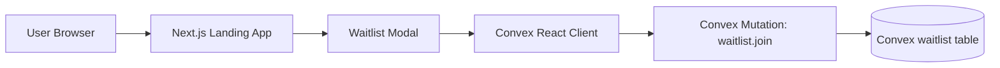

# Signpost Landing Page

Landing page + waitlist funnel for Signpost ("Learn ASL Fast"), built with Next.js and Convex.

[](https://nextjs.org)
[](https://convex.dev)
[](https://signpost.cv)

## Live Links

- Main site: https://signpost.cv
- Demo: https://demo.signpost.cv
- Convex Dashboard: https://dashboard.convex.dev
- Convex Docs: https://docs.convex.dev

## Stack

- Next.js 16 (App Router)
- React 19
- TypeScript
- GSAP + ScrollTrigger
- Convex (waitlist data + mutation API)

## Prerequisites

- Node.js 20+
- npm (or Bun if you prefer)
- A Convex project/deployment

## Environment Variables

Create `.env.local` with:

```bash
NEXT_PUBLIC_CONVEX_URL=https://<your-deployment>.convex.cloud
NEXT_PUBLIC_CONVEX_SITE_URL=https://<your-deployment>.convex.site
```

`NEXT_PUBLIC_CONVEX_URL` is required by `src/app/ConvexClientProvider.tsx`.

## Local Development

1. Install dependencies:

```bash
npm install
```

2. Start Convex dev backend (in a separate terminal):

```bash
npx convex dev
```

3. Start Next.js:

```bash
npm run dev
```

4. Open http://localhost:3000

## Scripts

- `npm run dev` - start local Next.js dev server
- `npm run build` - production build
- `npm run start` - run production server
- `npm run lint` - run ESLint

## Waitlist Backend (Convex)

- Schema: `convex/schema.ts`
- Mutation: `convex/waitlist.ts` (`waitlist.join`)
- Client integration: `src/app/WaitlistModal.tsx`

Current protections in waitlist flow:

- Hidden honeypot field for bot detection
- Email format validation + normalization
- Blocklist for disposable email domains
- Duplicate email protection (`by_email` index)
- Global rate limit (10 signups / 60 seconds)

## Architecture



Key files:

- App shell/page: `src/app/page.tsx`
- Convex provider: `src/app/ConvexClientProvider.tsx`
- Waitlist modal/client mutation call: `src/app/WaitlistModal.tsx`
- Waitlist mutation: `convex/waitlist.ts`
- Waitlist schema: `convex/schema.ts`

## Security Headers

Security headers are configured globally in `next.config.ts`:

- `Content-Security-Policy`
- `X-Content-Type-Options`
- `X-Frame-Options`
- `Referrer-Policy`
- `Permissions-Policy`
- `Cross-Origin-Opener-Policy`
- `Cross-Origin-Embedder-Policy`
- `Cross-Origin-Resource-Policy`
- `X-Permitted-Cross-Domain-Policies`
- `Strict-Transport-Security` (production only)

Framework disclosure is disabled with:

- `poweredByHeader: false`

Quick check:

```bash
curl -I http://localhost:3000
```

## Deployment Notes

- Recommended platform: Vercel
- Set the same `.env.local` variables in Vercel project env settings
- Run `npx convex deploy` before/with frontend deploy for production Convex functions

## Troubleshooting

- Build may fail in restricted/offline environments because `next/font/google` fetches fonts at build time.
- If waitlist mutations fail, verify `NEXT_PUBLIC_CONVEX_URL` points to the active Convex deployment.
