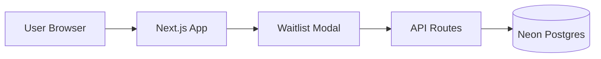

# Signpost Landing Page

Landing page + waitlist funnel for [Signpost](https://signpost.cv) — learn ASL with real-time AI computer vision feedback.

[](https://nextjs.org)
[](https://neon.tech)
[](https://signpost.cv)

## Live Links

- Main site: https://signpost.cv
- Demo: https://demo.signpost.cv

## Stack

- Next.js 16 (App Router)
- React 19
- TypeScript
- GSAP + ScrollTrigger (animations)
- Neon Serverless Postgres (waitlist data)
- Vercel (hosting)

## Prerequisites

- Node.js 20+
- npm
- A [Neon](https://neon.tech) project with a `waitlist` table

## Environment Variables

Create `.env.local` with:

```bash
DATABASE_URL=postgresql://<user>:<password>@<host>.neon.tech/<dbname>?sslmode=require
```

## Local Development

1. Install dependencies:

```bash
npm install
```

2. Start Next.js:

```bash
npm run dev
```

3. Open http://localhost:3000

## Scripts

- `npm run dev` — start local dev server
- `npm run build` — production build
- `npm run start` — run production server
- `npm run lint` — run ESLint

## Waitlist Backend

The waitlist is powered by Neon Serverless Postgres with Next.js API routes:

- **Join**: `POST /api/waitlist/join` → `src/app/api/waitlist/join/route.ts`
- **Check status**: `POST /api/waitlist/check` → `src/app/api/waitlist/check/route.ts`
- **DB connection**: `src/lib/db.ts`
- **Frontend modal**: `src/app/WaitlistModal.tsx`

Protections:

- Hidden honeypot field for bot detection
- Email format validation + normalization
- Blocklist for disposable email domains
- Duplicate email protection (`ON CONFLICT DO NOTHING`)
- In-memory rate limiting

## Architecture



Key files:

- Landing page: `src/app/page.tsx`
- Waitlist modal: `src/app/WaitlistModal.tsx`
- API route (join): `src/app/api/waitlist/join/route.ts`
- API route (check): `src/app/api/waitlist/check/route.ts`
- DB connection: `src/lib/db.ts`

## Security Headers

Security headers are configured in `next.config.ts`:

- `Content-Security-Policy`
- `X-Content-Type-Options`
- `X-Frame-Options`
- `Referrer-Policy`
- `Permissions-Policy`
- `Cross-Origin-Opener-Policy`
- `Cross-Origin-Embedder-Policy`
- `Cross-Origin-Resource-Policy`
- `X-Permitted-Cross-Domain-Policies`
- `Strict-Transport-Security` (production only)
- `poweredByHeader: false`

## Deployment

- Platform: Vercel
- Set `DATABASE_URL` in Vercel project environment variables
- Ensure the Neon `waitlist` table exists before deploying

## Troubleshooting

- Build may fail in offline environments because `next/font/google` fetches fonts at build time.
- If waitlist API routes return 500, verify `DATABASE_URL` is set and the Neon project is active.
